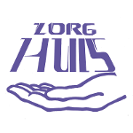

# Charity

## Zorghuis Oostende

 

“Het Zorghuis” is like a home for cancer patients. A team of volunteers are committed to give their guests the attention and the care they need during the worst days of their treatment.
“Het Zorghuis” moved earlier this year. Your donation will be used to furnish the house as comfortably as possible.

- [Website Zorghuis](http://www.zorghuisoostende.be)
- [Facebook Zorghuis](http://www.facebook.com/ZorghuisO)

## Huis aan Zee

 

Not every child is lucky enough to grow up in a loving and stable home.  
“Huis aan Zee” is a boarding school which provides permanent and temporary shelter to more than 100 children between 2,5 and 21 years old . These children are placed there (usually by the juvenile court) because they cannot get the attention they need at  home for several reasons. 
Your donation will be used to organise summer camps, a nice initiative and experience they can share with their friends at school. 

- [Website Huis aan Zee](http://www.devloedlijn.be/huisaanzee)
- [Facebook Huis aan Zee](http://www.facebook.com/mpiHuisAanZee)

## Veld & Duin’s contribution
- We give € 5 to charity per reservation in a chalet or in a flat and transfer the money to the account every three months.
- We give  € 0,40 to charity for every Veld & Duin pin sold.

## Your call
It would be nice if you came up with an idea for charitable work.
We might be able to help you with logistics (tables, chairs).

We will put your charitable event or action on our website.
