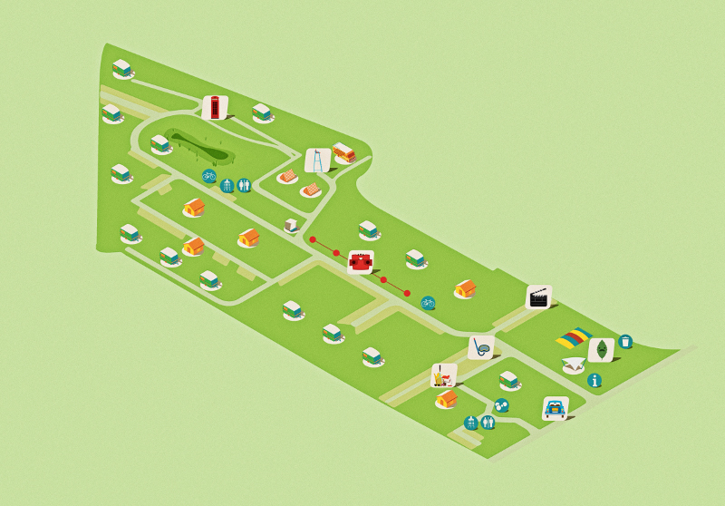



## Practical

The exhibition is held on 7 different locations. The order in which you visit them is completely unimportant. 

The exhibition is open every day between 9 a.m. and 9 p.m. The film cabinet and the lost property chalet can only be visited during the [opening hours of reception][openingsuren.en].

During the festive weekend of June 3rd you can register for a guided tour. More information about extra tours can be found on our anniversary site and on Facebook.

Children will love our exhibition and they can win a prize if they fill in the puzzle.

## Bonus material

To make the most out of your visit, bring your smartphone or tablet with you and get bonus material
Preferably use earphones for listening to the audio clips.

You can find bonus material on this website. There is a sign with a QR-code which takes you to the right page at every location.

OConsulting our anniversary site is free. Would you rather save your data subscription, feel free to use our  [wifi on the campsite][wifi.en]. Tickets during [opening hours of the reception][openingsuren.en] available as from € 2.
Naturally you can have a look at all the material at home, before or after your visit.

## Last but not least

We kindly ask our visitors to be respectful, to leave every object as it is and not to damage anything. Please do not disturb the campers and respect their privacy.

Enjoy, remember and admire. We are interested in your feedback.
