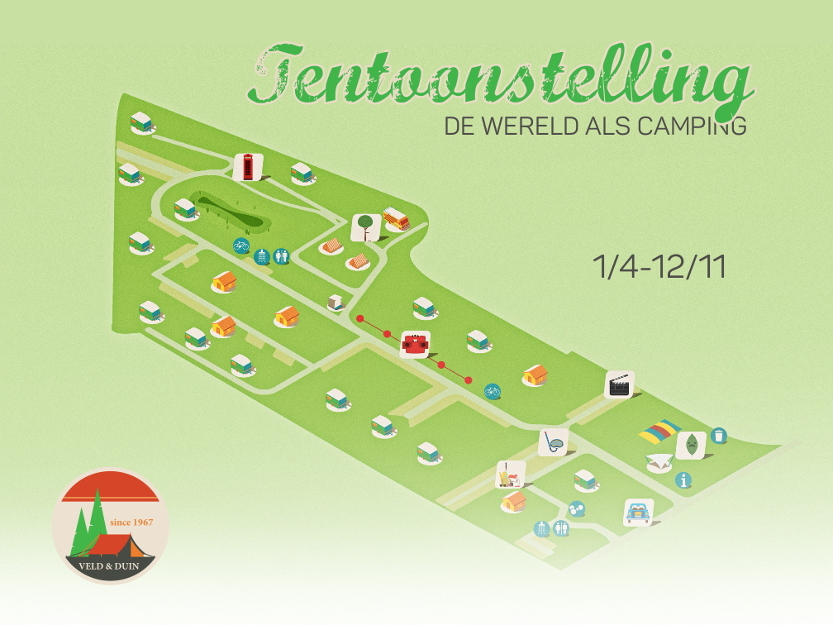



## Praktisch

De tentoonstelling  bestaat uit 8 verschillende locaties. De volgorde waarin je de locaties bezoekt is compleet onbelangrijk. 

De tentoonstelling is elke dag te bezoeken tussen 9 tot 21 uur. Het filmkabinet en de chalet met de verloren voorwerpen zijn enkel te bezoeken tijdens de [openingsuren van de receptie][openingsuren.nl].

Tijdens het feestweekend van 3 juni worden rondleidingen met gids voorzien (vooraf inschrijven). Eventuele extra rondleidingen worden aangekondigd op de jubileumsite en facebook.

De tentoonstelling is ook erg leuk om te bezoeken met kinderen. Bovendien kunnen zij een mooie prijs winnen als ze de kinderpuzzel invullen. 

## Bonusmateriaal

Haal nog meer uit je bezoek en breng je smartphone of tablet mee voor extra bonusmateriaal. Gebruik ter plaatse bij voorkeur oortjes voor het beluisteren van de geluidsfragmenten.

Het bonusmateriaal vind je op deze website. Ter plaatse is er per locatie een bord met een QR-code die je meteen naar de juiste pagina brengt.

Onze jubileumsite is voor iedereen publiek en gratis toegankelijk. Wil je toch liever je data-abonnement sparen, dan kun je gebruik maken van de [wifi op de camping][wifi.nl]. Tickets tijdens de [openingsuren van de receptie][openingsuren.nl] verkrijgbaar vanaf € 2.
Uiteraard kun je voor of na je geplande bezoek het materiaal op deze pagina's ook thuis bekijken.

De volledige verhalen bij elke locatie vind je in de tentoonstellingsgids die verkrijgbaar is op de tentoonstelling.

## Ten slotte

Vragen we de bezoekers het nodige respect op te brengen door niks mee te nemen of te beschadigen en de kampeerders die in de buurt van een locatie wonen niet te storen.

Geniet, herinner en verwonder en laat ons graag weten wat je ervan vond.
